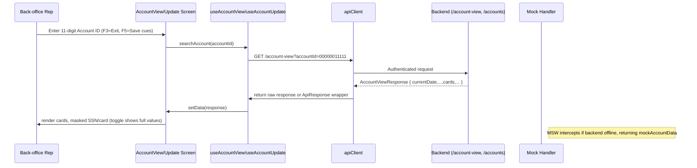

# 💳 ACCOUNT - Accounts module

**Module ID**: `account`  
**Version**: 1.0  
**Last update**: 2026-10-02  
**Purpose**: Provide the back-office views and APIs that allow representatives to search, inspect, and update customer credit accounts with precise business validations.

---

## 📋 High-Level Description

The ACCOUNT module orchestrates the full lifecycle of a credit account lookup and update. It exposes two dedicated screens (`AccountViewPage` and `AccountUpdatePage`) that reuse shared hooks and components to keep the experience consistent with Material-UI patterns already adopted elsewhere in the app.

### Key Responsibilities

- Lookup accounts by the 11-digit identifier (with built-in masking and test data shortcuts)
- Surface balance, cycle, card, and customer details in a single responsive layout
- Allow in-place editing of limits, contact data, and identity attributes guarded by an edit mode toggle
- Validate account numbers, enforce active-status rules, and confirm updates before hitting the backend
- Provide a reusable foundation (`useAccountView` / `useAccountUpdate`) that can be extended by other features such as billing or credit operations

---

## 🏗️ Architecture & Components

### Pages

- `app/pages/AccountViewPage.tsx`: wires `useAccountView` into `AccountViewScreen`, passing the `searchAccount` mutation plus loading/error states.
- `app/pages/AccountUpdatePage.tsx`: same pattern for `useAccountUpdate` and `AccountUpdateScreen`.
- Routes defined in `app/App.tsx` load these pages lazily under `/account/view` and `/account/update` entries that appear in `app/data/menuData.ts` (menu IDs correlate with the module for the UI grid). The menu entries themselves rely on the `Menu` module but respect the `authSlice` state so only authenticated users can reach ACCOUNT screens.

### Components & Hooks

| Component / Hook | Path | Responsibilities |
| --- | --- | --- |
| `AccountViewScreen.tsx` | `app/components/account/AccountViewScreen.tsx` | Search form that enforces 11-digit numeric account IDs, toggles sensitive data visibility (`showSensitiveData`), displays test accounts, and renders summary cards with balances, cards, and customer addresses using `Paper`, `Grid`, and `Typography` from MUI. A `SystemHeader` with transaction metadata keeps it consistent with legacy screens. |
| `AccountUpdateScreen.tsx` | `app/components/account/AccountUpdateScreen.tsx` | Search + edit UI with `Switch`-controlled “Edit Mode”, `TextField` grids for account/customer data, budget chips, `Dialog` for confirmation, and contextual helper text (F3=Exit, F5=Save, F12=Cancel). `hasChanges` plus `validationErrors` control the enabled state of Save/Reset actions. |
| `useAccountView` | `app/hooks/useAccountView.ts` | Encapsulates the `useMutation` retry against `/account-view` (query string) and `/account-view/initialize`, logs responses, and exposes `clearData` / `initializeScreen` helpers for integration tests and downstream modules. Uses `apiClient` to automatically pad IDs and detect MSW vs backend responses. |
| `useAccountUpdate` | `app/hooks/useAccountUpdate.ts` | Manages the `GET /accounts/{accountId}` lookup, the `PUT /accounts/{accountId}` update, JSON change detection (`hasChanges`), `resetForm`, and unified loading/error states for the page to show `LoadingSpinner` or inline `Alert`s. |
| `apiClient` + `useMutation` | `app/services/api.ts` & `app/hooks/useApi.ts` | Provides timeout handling, Authorization header with bearer token from `localStorage`, raw-response detection for account view (looks for `currentDate`/`transactionId`), and the shared `LoadingSpinner`/`Alert` UX. |

### Mock Infrastructure

- `app/mocks/accountHandlers.ts`: defines `mockAccountData` keyed by account IDs (e.g. `11111111111`, `22222222222`, `33333333333`, `44444444444`) plus the validation errors exposed by the screen.
- `app/mocks/accountUpdateHandlers.ts`: exposes the GET/PUT endpoints that mirror the real API payloads and returns a polished `AccountUpdateData` for each ID (it re-uses `eftAccountId`, `groupId`, `ficoScore`, etc.).
- Both handlers feed into MSW (`app/mocks/handlers.ts`), ensuring the module works without a backend during local development while still obeying Production response shapes.

### Flow Diagram



---

## 🌐 Public Interfaces (APIs)

### `GET /api/account-view?accountId={11-digit}`
Request example:

```http
GET /api/account-view?accountId=00000011111
Authorization: Bearer <token>
```

Response fields (from `AccountViewResponse`):
- `currentDate`, `currentTime`, `transactionId`, `programName`
- `accountStatus`, `currentBalance`, `creditLimit`, `cashCreditLimit`, `currentCycleCredit`, `currentCycleDebit`, `groupId`
- Customer info: `customerId`, `firstName`, `middleName`, `lastName`, `addressLine1-3`, `city`, `state`, `zipCode`, `country`, `phoneNumber1/2`, `customerSsn`, `governmentId`, `ficoScore`, `dateOfBirth`, `primaryCardHolderFlag`, `cardNumber`, `eftAccountId`
- Control flags: `inputValid`, `accountFilterValid`, `foundAccountInMaster`, `foundCustomerInMaster`, `errorMessage`, `infoMessage`

### `GET /api/account-view/initialize`
Used by `useAccountView.initializeScreen` during page load to show default data (handles both MSW success payload and raw backend payload). Same response schema as above.

### `GET /api/accounts/{accountId}`
Returns the editable payload consumed by `useAccountUpdate`. Sample fields:

```json
{
  "accountId": 11111111111,
  "activeStatus": "Y",
  "currentBalance": 1240.5,
  "creditLimit": 5000,
  "cashCreditLimit": 1500,
  "groupId": "G1",
  "customerId": 501,
  "firstName": "John",
  "lastName": "Smith",
  "stateCode": "CA",
  "countryCode": "US",
  "zipCode": "90001",
  "phoneNumber1": "555-1234",
  "ssn": "123-45-6789",
  "governmentIssuedId": "GOV12345",
  "ficoScore": 720
}
```

### `PUT /api/accounts/{accountId}`
Accepts the same shape as `AccountUpdateData` (`AccountUpdateSubmission` extends it). The client sends all fields, even those that did not change, and relies on the backend to persist deltas. The response is `AccountUpdateResponse` with `success`, optional `data`, `message`, and `errors`.

---

## 🔢 Data Models

### `AccountViewResponse` (excerpt from `app/types/account.ts`)

```ts
interface AccountViewResponse {
  currentDate: string;
  currentTime: string;
  transactionId: string;
  programName: string;
  accountId?: number;
  accountStatus?: string;
  currentBalance?: number;
  creditLimit?: number;
  cashCreditLimit?: number;
  currentCycleCredit?: number;
  currentCycleDebit?: number;
  groupId?: string;
  customerId?: number;
  customerSsn?: string;
  firstName?: string;
  lastName?: string;
  addressLine1?: string;
  city?: string;
  state?: string;
  zipCode?: string;
  phoneNumber1?: string;
  governmentId?: string;
  cardNumber?: string;
  eftAccountId?: string;
  inputValid: boolean;
  accountFilterValid?: boolean;
  foundAccountInMaster?: boolean;
}
```

### `AccountUpdateData` (excerpt from `app/types/accountUpdate.ts`)

```ts
interface AccountUpdateData {
  accountId: number;
  activeStatus: string;
  currentBalance: number;
  creditLimit: number;
  cashCreditLimit: number;
  openDate: string;
  expirationDate: string;
  groupId: string;
  customerId: number;
  firstName: string;
  middleName?: string;
  lastName: string;
  addressLine1: string;
  stateCode: string;
  countryCode: string;
  zipCode: string;
  phoneNumber1: string;
  ssn: string;
  governmentIssuedId: string;
  dateOfBirth: string;
  primaryCardIndicator: string;
  ficoScore: number;
}
```

---

## 📋 Business Rules

1. **Account ID validation**: inputs must be exactly 11 digits (`useAccountView` + `useAccountUpdate`) and cannot be `00000000000`. Validation fires before hitting the backend and sets `fieldError`.
2. **Active status gating**: only accounts whose `activeStatus === 'Y'` are considered valid for transactions. The UI shows a status chip that changes color via `getStatusColor`.
3. **Available credit**: calculated client-side as `creditLimit - currentBalance`; negative balances indicate overdrafts.
4. **Sensitive data**: SSN and card number are masked by default, toggled via `showSensitiveData`. This matches PCI expectations and is reset when the screen unmounts.
5. **Edit mode**: the `Switch` guard in `AccountUpdateScreen` prevents accidental writes; `Save` & `Reset` buttons remain disabled until `hasChanges` is true.
6. **Confirmation**: a `Dialog` prompts before persisting updates to remind users that both account and customer records change.
7. **Test accounts**: the view screen exposes a collapsible list of predefined IDs (`11111111111`, `22222222222`, `33333333333`, `44444444444`) to accelerate demos.

---

## 👥 Actors & User Journeys

- **Primary actor**: Back-office representative or collector who must confirm balances and personalize terms during a support call.
- **Secondary actor**: Admin who adjusts limits, contact info, or escalates to compliance.

### Example journeys

1. **Verify account details**  
   As a rep, I search by account ID, review balance/credit, verify active cards, and confirm the customer address before responding to a dispute.
2. **Update customer profile**  
   As an admin, I toggle edit mode, refresh FICO score, adjust the credit limit, and save changes after the confirmation dialog.
3. **Masking compliance**  
   As a compliance analyst, I view SSN/card digits only when absolutely necessary by toggling the visibility button.

---

## 🎯 User Stories & Acceptance Criteria

### Story 1: Account lookup for support
```
As a back-office representative,
I want to search an account by its 11-digit ID,
So that I can see balances, cycle data, and customer contact details during a call.
```
**Acceptance Criteria**:
- Input accepts only digits and enforces 11 characters before calling the API.
- The view shows summary cards for balances, cards, and contact data.
- Errors from the backend (`errorMessage`) surface in an `Alert`.
- Sensitive data is masked unless the toggle is on.
- Keyboard shortcuts (F3=Exit) stay responsive even when an error appears.
**Complexity**: Simple (1-2 pts) – reuse `AccountViewScreen` and existing hooks.

### Story 2: Account update with validation
```
As an admin,
I want to edit the account and customer fields and submit them together,
So that updates are synchronized in a single operation.
```
**Acceptance Criteria**:
- Clicking the “Edit Mode” switch enables the form and keeps `Save` disabled until `hasChanges` is true.
- Both account-level fields (credit limit, group) and customer contact fields (address, phone) allow editing.
- Validation errors appear inline (e.g., ZIP code) before the PUT request.
- Confirmation dialog appears before the request is sent.
**Complexity**: Medium (3-5 pts) because it involves form validation, change detection, confirmation, and `PUT /accounts/{accountId}`.

### Story 3: Compliance review of sensitive data
```
As a compliance analyst,
I want to temporarily reveal SSN and card numbers only when needed,
So that sensitive data stays masked during regular use.
```
**Acceptance Criteria**:
- `AccountViewScreen` renders masked SSN/card fields by default.
- Toggling the “Show Sensitive Data” button reveals the values and re-masks when toggled off.
- No sensitive data persists in localStorage.
**Complexity**: Simple (1-2 pts). This relies on the `showSensitiveData` state already maintained in the view screen.

---

## ⚡ Development Patterns & Acceleration

- **Hook pattern**: `useAccountView` and `useAccountUpdate` expose loading/error/data plus helpers (`clearData`, `resetForm`) so the pages remain thin.
- **Page-based forms**: inputs are inline `TextField`s instead of modals, matching other modules (e.g., `TransactionAddScreen`).
- **MUI components**: `Chip`, `Card`, `Grid`, `Stack`, `Button`, `Switch`, `Dialog` deliver consistent spacing and responsive behavior.
- **Change detection**: JSON string comparison between `accountData` and `originalData` stops accidental saves by gating the `hasChanges` flag.
- **Confirmation dialog**: ensures manual review before hitting `PUT /accounts/{accountId}`.
- **Keyboard helpers**: the footer lists F3/F5/F12 to mirror legacy behavior and support power users.

### Complexity Guidelines
- **Simple (1-2 pts)**: Adding a read-only field, adjusting text, or wiring a new helper to the existing hook.
- **Medium (3-5 pts)**: Adding new validation rules, field-level dependencies, or partial integration with another module (e.g., hooking to billing metadata).
- **Complex (5-8 pts)**: Replacing the editable form with a multi-tab experience, integrating with an external scoring service, or synchronizing with backend audit logs.

---

## 🧪 Testing & Mocks

- **MSW handlers**: `app/mocks/accountHandlers.ts` and `app/mocks/accountUpdateHandlers.ts` ship with samples and validation scenarios (missing ID, invalid ID, missing data). They are referenced in `app/mocks/handlers.ts` and stay active whenever `VITE_USE_MOCKS=true`.
- **Test accounts**: `testAccounts` array inside `AccountViewScreen` (IDs `11111111111`, `22222222222`, `33333333333`, `44444444444`) accelerates QA and demos.
- **Mock updates**: `AccountUpdateHandlers` return the same shape the real backend expects, including `eftAccountId`, `primaryCardIndicator`, and `ficoScore`. They log updates to the console for traceability.

---

## ⛓️ Dependencies & Impact

- **Auth module (`authSlice`, `ProtectedRoute`)**: ensures account screens require a bearer token so `apiClient` can attach `Authorization` headers.
- **Menu module**: exposes menu entries that point at `/account/view` and `/account/update`; these entries honor the authenticated state.
- **Credit Card / Bill Payment / Transaction modules**: rely on account lookups for context (cards list handles `accountId`, bill payment uses the same account validation helpers). They depend on the same 11-digit validation pattern.
- **SystemHeader & LoadingSpinner UI utilities**: shared components keep the header transaction metadata and spinner behavior consistent with other modules.

---

## 🚨 Risks & Technical Debt

- **Risk**: Backend tolerates only padded 11-digit IDs. The client converts with `parseInt` then `padStart`, but any future endpoint expecting other formats must be coordinated with platform engineering. 📌 Mitigation: always run integration tests against `apiClient` to confirm `_account-view` requests remain GET with `accountId` query.
- **Risk**: Real backend may return extra fields not in the mocks, so screens must rely on optional chaining (`?.`). Tests should include `API_BASE_URL` variations (`/api` vs `/demo-sai-3-aws/api`).
- **Tech debt**: `AccountUpdateScreen` still sends the full payload even for minor changes. A future optimization could diff fields and send a delta, but that requires backend support for partial updates.
- **Tech debt**: No real i18n structure; text lives in English strings inside components. Adding translations would require migrating UI text to resource files.

---

## ⚡ Performance Targets

- **First Contentful Paint**: Keep the Account view/update route FCP < 1.2s on typical Chrome devices (the page reuses `SystemHeader` + `Paper` so the baseline is light).
- **API latency**: The `/account-view` lookup should respond within 350ms (P95). The `useAccountView` hook transparently shows a spinner until `loading` clears, so any delay is visible to the rep.
- **Update latency**: `PUT /accounts/{accountId}` should resolve within 600ms (P95). The confirmation dialog prevents duplicate submissions while the request is inflight.
- **Success rate**: Aim for 99% of update calls to return `success: true` without validation errors; validation errors should show the `Alert` with the server-provided `errors[]`.

---

## ✅ Task List

- [x] Document the lookup screen, hooks, and MSW handlers  
- [x] Capture update form behaviors, validation, and confirmation flow  
- [ ] Add an integration test that hits `/account-view/initialize` with mocked data  

---

## 📈 Success Metrics

- **Adoption**: 100% of support representatives use the lookup screen before escalating tickets.  
- **Accuracy**: 95% of user stories referencing the ACCOUNT module cite the documented APIs and hooks.  
- **Business impact**: Reduce average call resolution time by 15% because reps have credit/account data in one view.

---

## 🔍 See Also

- `docs/site/modules/accounts/index.html` (rich HTML guide with user story patterns and copy-ready templates).  
- `docs/system-overview.md` → search for `ACCOUNT` (it links back to this module).  

**Mantenido por**: Equipo DS3A  
**Precisión del código**: 95%+
